# Create It Now!


## App Info:

* Team Name: Free Labor
* App Name: Create It Now!
* App Link: <https://project-2---maker-s-journal.web.app> (Database service expired)

### Description
Use Create It Now to develop to-do lists for projects you are working on. After the completion of each to-do list item, you may write a journal entry (complete with a photo) to track your progress throughout the project to meet their goals. Created with Vue, Firebase, and Bootstrap5.

### Authors

* Wiley Bui, buixx206@umn.edu
* Ally Goins, goin0004@umn.edu
* Ray Lauffer, lauff007@umn.edu
* Jakob Speert, speer034@umn.edu
* Elise Tran, tran0592@umn.edu


## Key Features

* Users can either take a picture or upload an image from their device to a journal entry.
* Push notifications that notify the users of their past uncompleted to-do items and any upcoming to-do items that are due in the next 2 days.
* Responsiveness: Mobile and tablet friendly
* Project progress updates: When all of the to-do items from a project are completed, the entire project progress status changes to "Completed" from "In Progress".
* Tools: Usage of Bootstrap 5.0 to display multiple different accordions

## Video Demo of Site
[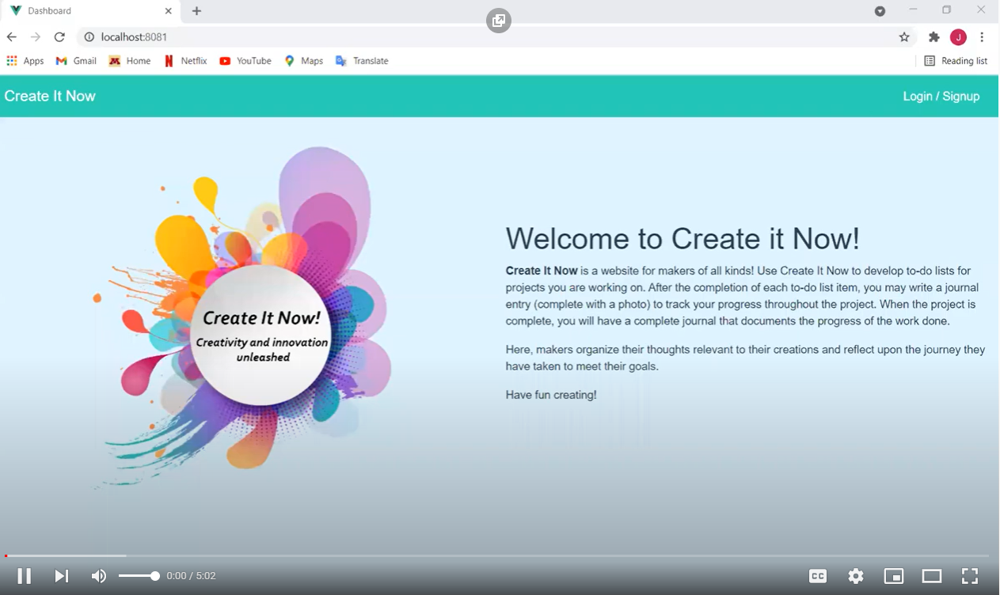](https://youtu.be/aPCzPmQX5l4 "Create It Now - Click to Watch!")

## Screenshots of Site

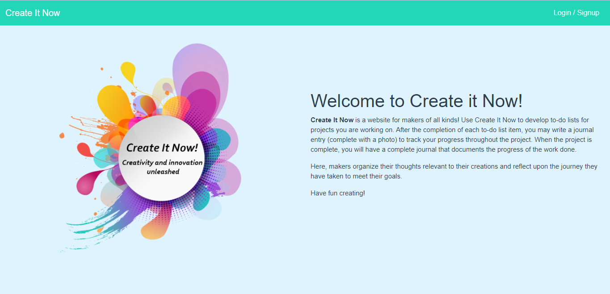

The "Welcome" Page introduces our site's visitors to the web site they have entered. Users must either login
or sign up to create their accounts in order to use the site. Users will be able to create projects with to-do
lists, and upon completion of a to-do item will be prompted to enter a journal entry/reflection about that portion
of the project (with a progress picture (and potentially other media like voice memos). The reflections will be
compiled into an entire journal-type documentation upon the completion of all to-do items.

### Dashboard Page
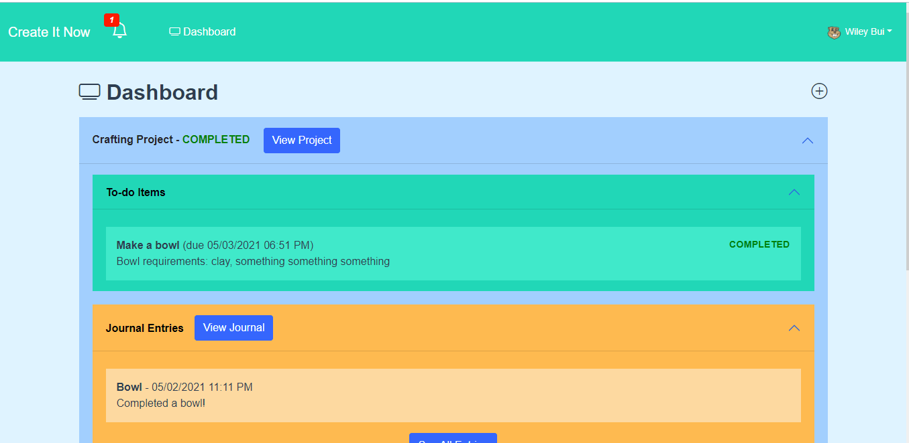

Once the user is logged in, the dashboard displays all of the user's projects. Within each project exists a
to-do and journals entries that they've made. Users may add a new project if they'd like by clicking the **+** icon.
However, if the user wants to view or update an existing property, they'd need to click the title (ie: Programming 
Bucket List, Craft-thingy, or View Journal Entry) to redirect to its own specific page (see below).

### Project-specific Page
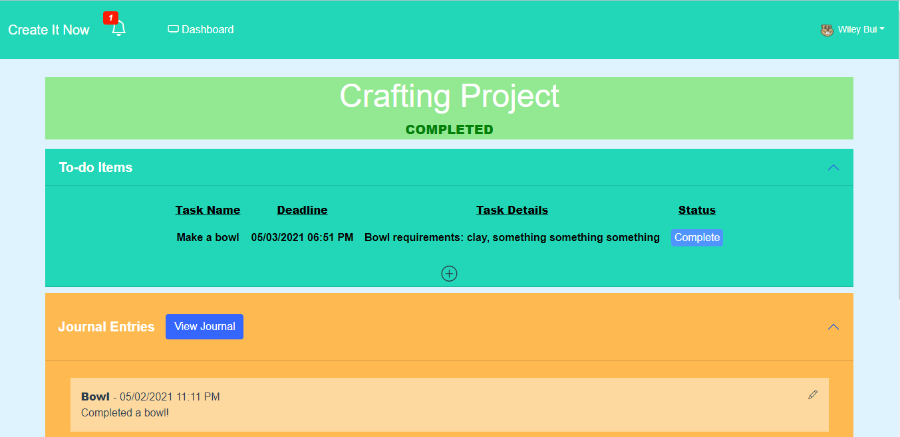

When the user clicks on the specific page, they may edit the contents that have made before. They may also 
delete the entire page if they'd like by clicking the "Delete" button. Here the user may also manage their to-do list
or view/edit existing journal entries.


### Add a Project & To-do Modals
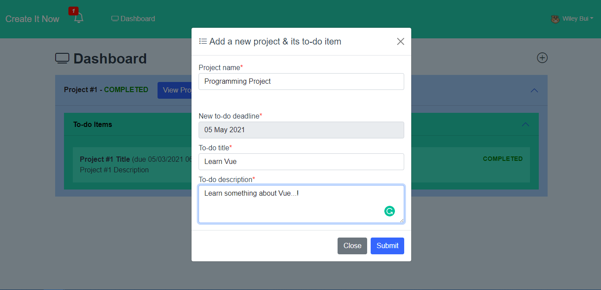

This page gets displayed when the user clicks the **+** icon from the dashboard or the menu page.
For adding a new list/to-do, the user can label the list name (title) and add a description of the task. Once the user is finished with 
adding everything, they can click "Submit" to submit their contents.


### Edit/Add a Journal Entry
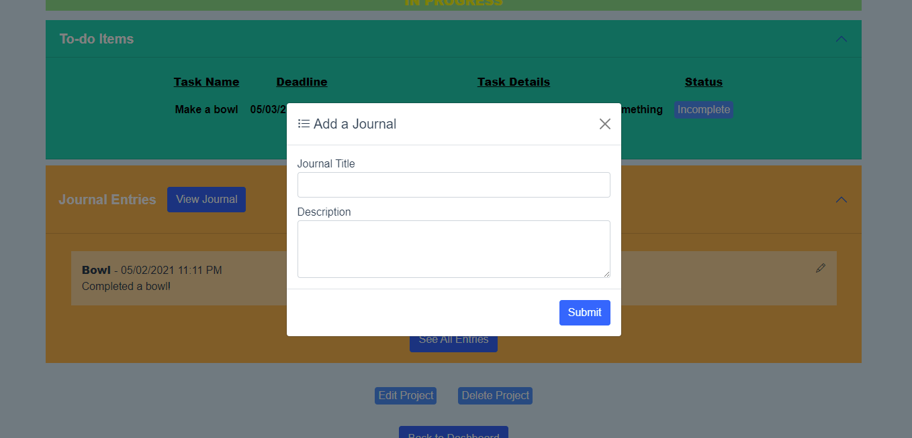

Users will have the opportunity to add a journal entry after they have completed a to-do item; this is an opportunity for the
user to reflect upon the challenges for that portion of the project in addition to what they enjoyed, what they disliked, or
what they would do differently next time. Users may also add a progress photo for the project at this time (with the option to open
a mobile device camera when applicable).

### Notification Modal
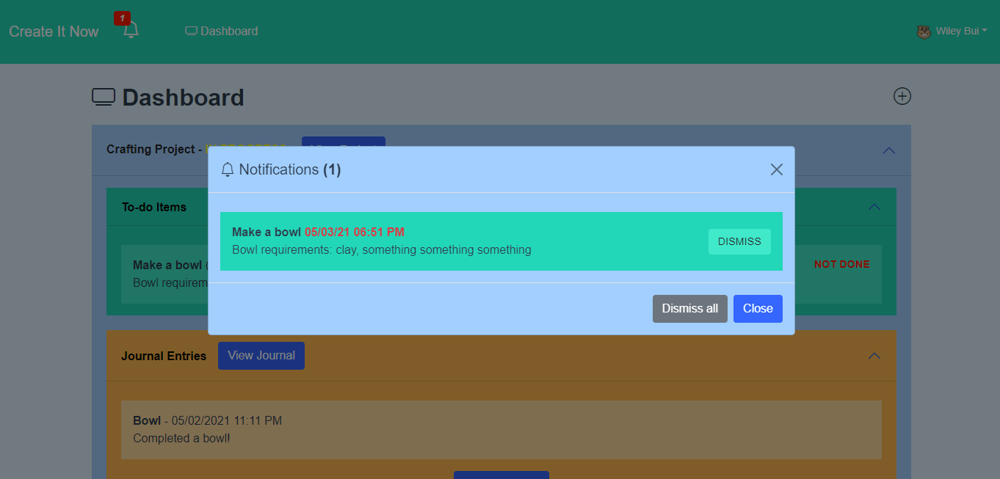

The notification modal only appears when the user is logged in. The notification number is composed of the number
of how many notifications that have not dismissed by the user. The notification notifies the users of their
past uncompleted to-do items and any to-do items that are due in the next 2 days.


### All Journal Entries (For a Project)
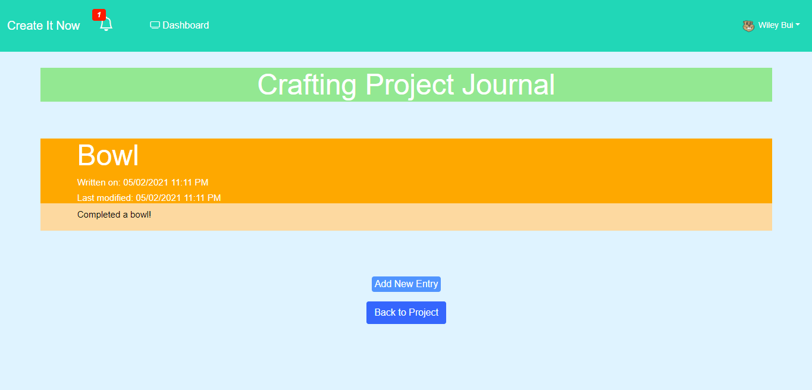

After the user completes a to-do list for a project, they can review the steps they took to bring their craft to fruition. This page
shows the completion (or progress thus far) of the project, showing the milestones of the project. The journal will be a nice accompaniment
to the completed project and may serve as a reminder of the work that was achieved.


## Mockup images

### Welcome Page
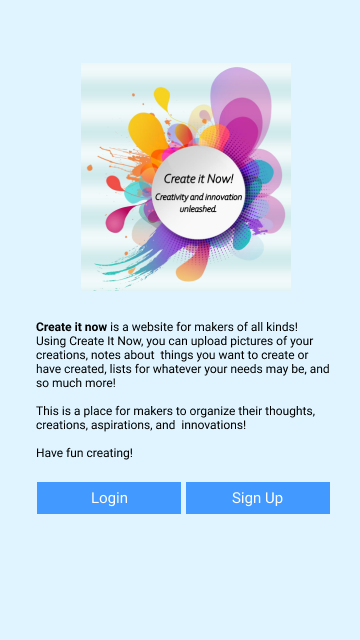

The "Welcome" Page introduces our site's visitors to the web site they have entered. Users must either login
or sign up to create their accounts in order to use the site. Users will be able to create projects with to-do
lists, and upon completion of a to-do item will be prompted to enter a journal entry/reflection about that portion
of the project (with a progress picture (and potentially other media like voice memos)). The reflections will be
compiled into an entire journal-type documentation upon the completion of all to-do items.

### Dashboard Page


Once the user is logged in, the dashboard displays all of the user's projects. Within each project exists a
to-do and journals entries that they've made. Users may add a new project if they'd like by clicking the **+** icon.
However, if the user wants to view or update an existing property, they'd need to click the title (ie: Programming 
Bucket List, Craft-thingy, or View Journal Entry) to redirect to its own specific page (see below).

### Project-specific Page
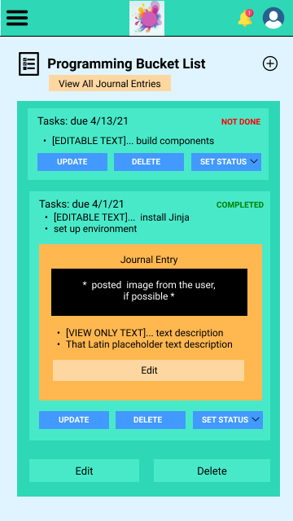

When the user clicks on the specific page, they may edit the contents that have made before. They may also 
delete the entire page if they'd like by clicking the "Delete" button. Here the user may also manage their to-do list
or view/edit existing journal entries.


### Add a Project & To-do Modals
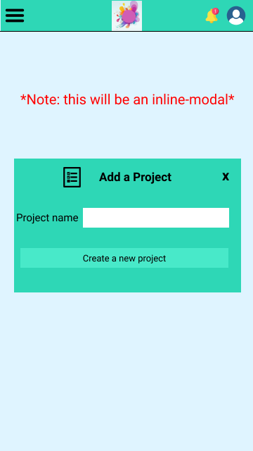 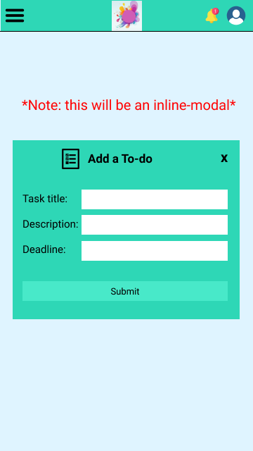

This page gets displayed when the user clicks the **+** icon from the dashboard or the menu page.
For adding a new list/to-do, the user can label the list name (title) and add a description of the task. Once the user is finished with 
adding everything, they can click "Submit" to submit their contents.


### Edit/Add a Journal Entry
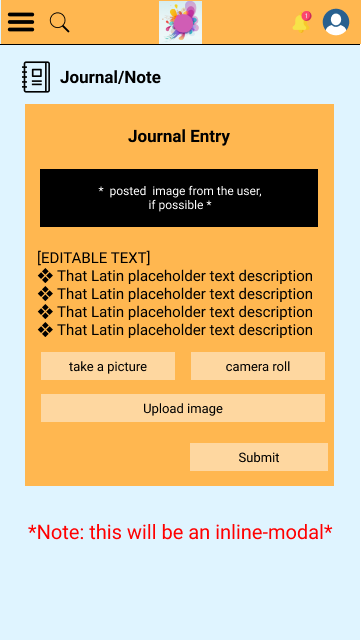

Users will have the opportunity to add a journal entry after they have completed a to-do item; this is an opportunity for the
user to reflect upon the challenges for that portion of the project in addition to what they enjoyed, what they disliked, or
what they would do differently next time. Users may also add a progress photo for the project at this time (with the option to open
a mobile device camera when applicable).

Users may also edit existing journal entries, in which case the same modal will be displayed with information filled in with the pre-existing
journal entry.

### Menu Page
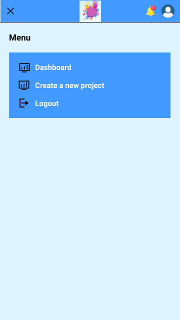

The menu bar only appears when the user is logged in. If the user clicks on the "hamburger" icon, this page 
displays the options that the user is allowed to do; they can redirec to the dashboard, create a new project, or log out.

### Notification Modal
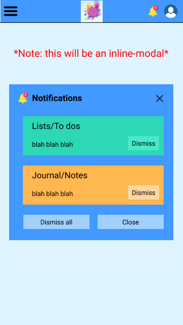

The notification modal only appears when the user is logged in. The notification number is composed of the number
of how many notifications that have not dismissed by the user. 

There are 3 categories for the notifications: Lists/To-Do (upcoming deadlines), Journal/Notes (milestones/complete journals ready),
and Site Notification (where the admin sends an important messages to everyone). The user can click "Dismiss" or "Dismiss all" to
decrease the notification number. Additionally, they can just close the modal by clicking "Close."


### All Journal Entries (For a Project)
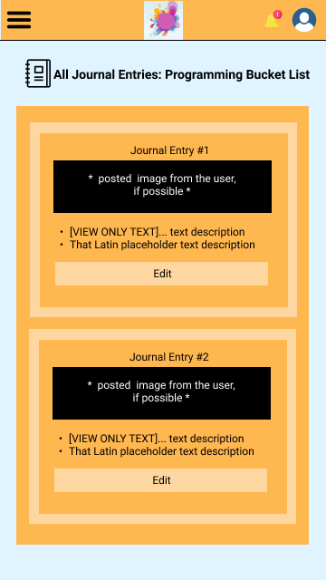

After the user completes a to-do list for a project, they can review the steps they took to bring their craft to fruition. This page
shows the completion (or progress thus far) of the project, showing the milestones of the project. The journal will be a nice accompaniment
to the completed project and may serve as a reminder of the work that was achieved.

...

# Firebase Setup Starting Point

This repo is intended to be a "starting point" for projects that use Firebase and Vue.

How we generated this project:

1. RUN THIS COMMAND IN THE PARENT DIRECTORY OF THE ACTUAL REPO DIRECTORY `vue create create-it-now` (create basic project template) 
2. `vue add router` (update template with vue router)
3. `npm install firebase` (add the firebase web API to this project)
4. added the `firebaseConfig.js` file and also the .env files
5. `npm install vuefire` (add the vue + firestore bindings to make firestore data easy to work with.)
6. updated the `main.js` file to use the vuefire plugin
7. when setting up the auth test we further updated main.js to make sure the authenticaiton info is loaded before rendering starts, and we updated the router configuration to check if a route wants authentication before routing.

I've included these instructions with the specific intent of helping you know what you need to do to get setup with firebase on your own project.

## References:

* <https://savvyapps.com/blog/definitive-guide-building-web-app-vuejs-firebase>
* <https://firebase.google.com/docs/firestore/quickstart>
* <https://vuefire.vuejs.org/vuefire/#why>
* <https://medium.com/@anas.mammeri/vue-2-firebase-how-to-build-a-vue-app-with-firebase-authentication-system-in-15-minutes-fdce6f289c3c>

### Project setup (do once after downloading)
1. Locally install dependencies with `npm install`
2. On [Google Firebase Console](https://console.firebase.google.com/), create a firebase project for this project
3. Configure the Firebase API.
    * Click the gear on the side-bar and go to project settings
    * At the bottom of this page is a "Your apps" page -- click the `</>` icon to setup the web-api
    * No need to setup firebase hosting right now, we saw that we can do this from the terminal easily enough already. Just register a nickname.
    * It's going to tell you to copy the configuration script into your code. Don't actually do that. Instead we will be using .env and .env.local files to configure this, just copy this data into a temporary file so you don't lose it immediately.
        * .env files are automatically loaded when serving or compiling your project and added to an environment variable.
        * .env.local is also loaded, but it is marked by .gitignore as a file to ignore -- its safe to put api keys and such in this file. (You api key should never go online)
    * Update the .env file based on the provided keys
    * Copy .env.local.example to .env.local and fill in the api key and appId.
4. (For testing the Firestore) in the Firebase Console go to Firestore Database, and create a database.
    * Use test mode. This will work for 30 days. You can update it later whenever you want.
    * Create a "words" collection, with an initial document based on: `{word: "cat", likes: 0}` (use an autogen ID)
5. (For testing authentication): go to the Firebase Console and click "Authentication." Then click on Google in the list of sign-in methods and enable it. You will need to list a support email for the log in (just yourself). 

### Further notes:
File storage requires being logged in. You can check out how that's setup in the code if you want.

### Running locally:
```
npm run serve
```
